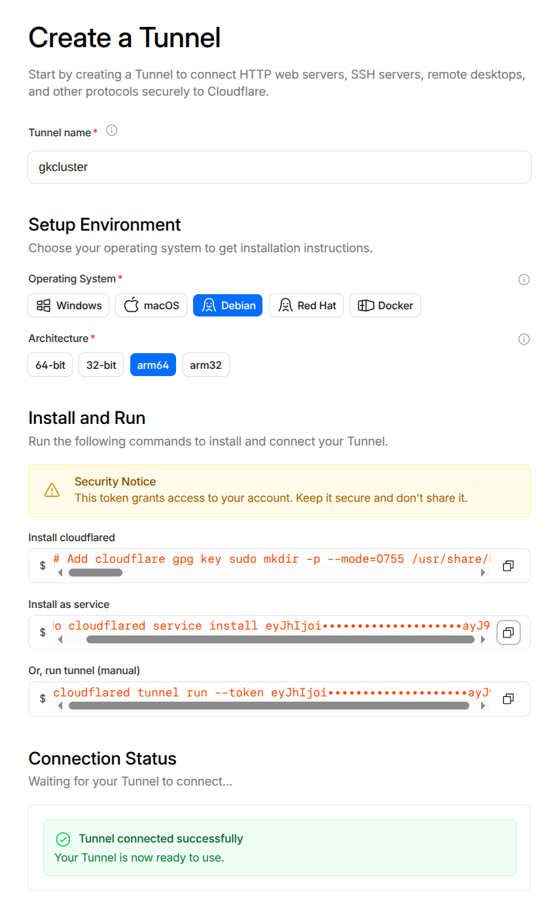

# Cloudflare Tunnel Setup Guide

This document walks through setting up a Cloudflare tunnel (`cloudflared`) to expose
selective cluster services to the internet — while keeping most services **LAN-only** —
and using Cloudflare's DNS API for Let's Encrypt certificate issuance.

## Architecture

```
INTERNET
  │
  ▼
Cloudflare Edge (WAF, DDoS protection, CDN)
  │  DNS: echo.gkcluster.org → <tunnel>.cfargotunnel.com  (Proxied ☁)
  │  HTTPS (Cloudflare manages external TLS)
  ▼
cloudflared pod (in cluster, outbound connection only — no inbound firewall ports needed)
  │  HTTP to ingress-nginx
  ▼
ingress-nginx → echo service

LOCAL NETWORK
  DNS: grafana/argocd/headlamp/longhorn.gkcluster.org → 192.168.1.82  (grey-cloud A records)
  Clients resolve directly to ingress-nginx without going via Cloudflare
```

**Key design decisions:**

- **Only `echo.gkcluster.org` is in the tunnel.** It has an explicit Cloudflare Tunnel DNS
  record (proxied). All other services use grey-cloud (DNS-only) A records pointing directly
  at the cluster's ingress IP — accessible from your LAN, but not reachable from the internet
  since the IP is private (`192.168.1.x`).
- **No wildcard CNAME in Cloudflare DNS.** A proxied `*` CNAME causes Cloudflare to
  advertise ECH (Encrypted Client Hello) via HTTPS DNS records for every subdomain. Chrome
  attempts ECH via Cloudflare's edge, which has no certificate for unregistered subdomains,
  causing `ERR_ECH_FALLBACK_CERTIFICATE_INVALID`. Each service must therefore have an
  **explicit** DNS record (either a Tunnel record for public services, or a grey-cloud A
  record for LAN-only services).
- **DNS-01 challenge for TLS certificates.** Let's Encrypt validates domain ownership by
  looking for a `_acme-challenge` TXT record in Cloudflare DNS. cert-manager automates
  this via the Cloudflare API. This works for **all** hostnames — including LAN-only services
  that have no public HTTP route — making it the correct choice over HTTP-01 here.
- **`cloudflared` uses an outbound connection only.** No inbound firewall ports need to be
  opened on your router. The pod connects outward to Cloudflare's edge network.

---

## Part 1: Cloudflare Web UI Setup

### 1.1 Add your domain to Cloudflare

If your domain is already registered with another registrar, delegate DNS to Cloudflare by
updating the nameservers at your registrar.

1. Log in to the [Cloudflare dashboard](https://dash.cloudflare.com).
2. In 'Account Home' use 'Onboard a Domain' or 'Buy a Domain'.
3. Wait for propagation (usually a few minutes to an hour).

### 1.2 Navigate to Tunnels

In the Cloudflare dashboard, click **Networking -> Tunnels** in the sidebar. This is where you will create and manage your tunnels.


### 1.3 Create a tunnel

2. Click **Create a tunnel**.
3. Select **Cloudflared** as the connector type.
4. Name the tunnel (e.g. `gk2`).
5. After creation, Cloudflare shows the steps to set up the cloudflared client.

We are going to be running cloudflared in K8S. But we will need to get the tunnel token from the "Install as service" box, so click the copy button next to it to copy the whole box content to your clipboard.

Extract the token by pasting into an editor and copying just the token. Then paste that token into the when prompted by the command in the following step.

#### 1.3a Deploy cloudflared before continuing

Cloudflare's UI will not let continue until it can see a live tunnel
connection. You must deploy the cloudflared pod and let it connect **now**, before proceeding
to §1.4.

Create a SealedSecret from the token you just copied:

```bash
# printf shows the prompt; read -rs reads silently without echoing or storing in history.
# Piping via /dev/stdin prevents the token appearing in process args (ps / /proc).
printf 'Tunnel token: ' && read -rs TOKEN && echo
printf '%s' "$TOKEN" | \
  kubectl create secret generic cloudflared-credentials \
    --namespace cloudflared \
    --from-file=TUNNEL_TOKEN=/dev/stdin \
    --dry-run=client -o yaml | \
  kubeseal --controller-name sealed-secrets --controller-namespace kube-system -o yaml > \
    kubernetes-services/additions/cloudflared/tunnel-secret.yaml
unset TOKEN
```

Commit and push so ArgoCD picks it up:

```bash
git add kubernetes-services/additions/cloudflared/tunnel-secret.yaml
git commit -m "Add cloudflared tunnel token SealedSecret"
git push
```

ArgoCD will sync the `cloudflared` Application, sealed-secrets will decrypt the secret, and
the cloudflared pod will start and connect outward to Cloudflare's edge. Watch the pod come
up:

```bash
kubectl rollout status deployment/cloudflared -n cloudflared
kubectl logs -n cloudflared deployment/cloudflared | tail -20
```

When you are successfully connected the panel at the bottom of the screen will read 'Tunnel connected successfully'. See image below.



### 1.4 Configure a public hostname for the example echo service

You will now see a list of your tunnels. Click on the tunnel you just created to view its details.

Now click on the Routes tab and '+ Add a route'. And choose 'Published Application' as the route type.

This will set up the public echo service which is just for testing to show how to set up an internet facing service.

The tunnel connects via **HTTP on port 80** to ingress-nginx. Cloudflare already terminates
external TLS at its edge — if the tunnel also used HTTPS and ingress-nginx forced a redirect
to HTTPS, it would cause a redirect loop back through the tunnel. The echo ingress has
`ssl-redirect: false` to match.

| Field | Value |
|---|---|
| Subdomain | `echo` |
| Domain | `gkcluster.org` |
| Service URL | `http://ingress-ingress-nginx-controller.ingress-nginx.svc.cluster.local:80` |


### 1.5 DNS record created automatically

After saving the public hostname, Cloudflare automatically creates a CNAME DNS record:

```
echo.gkcluster.org  →  <tunnel-id>.cfargotunnel.com   (Proxied ☁)
```

> **Do not add a wildcard `*` CNAME record (proxied or otherwise).** A proxied wildcard
> causes Cloudflare to publish an HTTPS DNS record advertising ECH for every subdomain,
> pointing at Cloudflare's edge. Chrome will attempt ECH via that edge for any subdomain
> (e.g. `grafana.gkcluster.org`), but Cloudflare has no cert for it, resulting in
> `ERR_ECH_FALLBACK_CERTIFICATE_INVALID` even when the backend is perfectly healthy.
>
> Instead, add explicit **grey-cloud A records** for each LAN-only service
> — see [Part 3](#part-3-cloudflare-dns-records-for-lan-only-services).

### 1.6 Create an API token for DNS-01 certificate issuance

cert-manager needs to add and remove `_acme-challenge` TXT records in Cloudflare DNS to
prove domain ownership for Let's Encrypt. It does this via a scoped API token.

1. In the Cloudflare dashboard, click **Manage Account → Account API Tokens →
   API Tokens**.
2. Click **Create Token**.
3. Click **Use template** next to **Edit zone DNS**.

[Screenshot: API Tokens page with "Create Token" button and "Edit zone DNS" template visible]

4. Configure the token:

| Setting | Value |
|---|---|
| Token name | `edit Zone DNS` (or similar) |
| Permissions | Zone → DNS → Edit |
| Zone Resources | Include → Specific zone → `your domain name` |
| TTL | Optional — leave blank or set an expiry |

5. Click **Continue to summary**, then **Create Token**. Copy the token value — it is
   **shown only once**.

6. Save this token for later, but make sure it is kept secret (e.g. does not get into your bash history!). You will create a Kubernetes secret from it in Part 4, below.


---

## Part 2: WAF (Web Application Firewall)

Since only `echo.gkcluster.org` is exposed publicly through the tunnel, the attack surface
is already small. Cloudflare's default WAF rules (DDoS protection, bot management) apply to
all proxied traffic automatically.

You can add an additional rate-limiting rule to prevent abuse of the echo endpoint:

1. In the Cloudflare dashboard for `gkcluster.org`, go to **Security → WAF → Rate Limiting
   Rules**.
2. Click **Create rule** and configure:

| Field | Value |
|---|---|
| Rule name | `Echo rate limit` |
| When incoming requests match… | Hostname equals `echo.gkcluster.org` |
| Rate limit: requests | 30 requests per 1 minute |
| Action | Block (or Managed Challenge) |

[Screenshot: WAF rate limiting rule configuration for echo.gkcluster.org]

---

## Part 3: Cloudflare DNS records for LAN-only services

For services not exposed via the tunnel (`argocd`, `headlamp`, `longhorn`, `grafana`),
add an explicit **grey-cloud (DNS-only) A record** in Cloudflare DNS for each one:

| Type | Name | Content | Proxy status |
|------|------|---------|-------------|
| A | `argocd` | `192.168.1.82` | DNS only (grey cloud) |
| A | `headlamp` | `192.168.1.82` | DNS only (grey cloud) |
| A | `longhorn` | `192.168.1.82` | DNS only (grey cloud) |
| A | `grafana` | `192.168.1.82` | DNS only (grey cloud) |

Use one of the worker node IPs (`192.168.1.82`–`.84`) — the ingress LoadBalancer is
reachable on all of them.

These records resolve to a private RFC-1918 address, so they are only reachable from
your LAN. External clients will get a DNS response pointing at an unreachable IP.

> **Why Cloudflare DNS records and not router DNS?**
> Adding the records in Cloudflare means they work for any LAN client that uses the public
> Cloudflare nameservers (most do), without needing to configure your router. It also keeps
> all DNS for the domain in one place.

> **Why not a wildcard `*` A record?**
> A proxied wildcard causes Chrome's `ERR_ECH_FALLBACK_CERTIFICATE_INVALID` (see §1.5).
> A grey-cloud wildcard would work around the ECH issue, but is still best avoided — explicit
> records make it immediately clear which services are intentionally accessible and which are
> not.

> Certificates for these services are still issued via Let's Encrypt DNS-01 and are fully
> trusted by browsers — the grey-cloud routing is transparent to certificate validation.

---

## Part 4: Kubernetes Configuration

### 4.1 Tunnel token secret (cloudflared)

Covered in [§1.3a](#13a-deploy-cloudflared-before-continuing) — the secret must be created
and the pod must be running before the Cloudflare UI allows public hostname configuration.

### 4.2 Cloudflare API token secret (DNS-01)

Using the API token copied in Step 1.6:

```bash
printf 'Cloudflare API token: ' && read -rs TOKEN && echo
printf '%s' "$TOKEN" | \
  kubectl create secret generic cloudflare-api-token \
    --namespace cert-manager \
    --from-file=api-token=/dev/stdin \
    --dry-run=client -o yaml | \
  kubeseal --controller-name sealed-secrets --controller-namespace kube-system -o yaml > \
    kubernetes-services/additions/cert-manager/cloudflare-api-token-secret.yaml
unset TOKEN
```

Then commit and push:

```bash
git add kubernetes-services/additions/cert-manager/cloudflare-api-token-secret.yaml
git commit -m "Add cert-manager Cloudflare DNS-01 API token SealedSecret"
git push
```

The `cert-manager` ArgoCD Application already sources the
`kubernetes-services/additions/cert-manager/` directory, so the SealedSecret will be synced
automatically.

### 4.4 cert-manager ClusterIssuer

The `ClusterIssuer` in `kubernetes-services/additions/cert-manager/issuer-letsencrypt-prod.yaml`
has been updated to use `dns01` with the Cloudflare API token:

```yaml
solvers:
  - dns01:
      cloudflare:
        apiTokenSecretRef:
          name: cloudflare-api-token
          key: api-token
```

This configuration applies to **all** certificates in the cluster, including those for
LAN-only services. cert-manager will add a temporary `_acme-challenge` TXT record via the
Cloudflare API, wait for Let's Encrypt to validate it, then remove the record.

### 4.5 Echo test service

The echo service is deployed as an ArgoCD Application from
`kubernetes-services/additions/echo/manifests.yaml`. It uses [ealen/echo-server](https://github.com/Ealenn/Echo-Server),
which returns a JSON response showing all incoming request details — useful for verifying
headers, TLS, and routing.

No manual action needed — ArgoCD syncs it automatically after the above secrets are in place.

---

## Part 5: Verification

Once ArgoCD has synced all applications, verify the setup:

### Check certificates

```bash
kubectl get certificate -A
```

All certificates should show `READY: True`. If any show `False`, check the cert-manager logs:

```bash
kubectl logs -n cert-manager deployment/cert-manager | tail -50
```

### Check cloudflared connectivity

```bash
kubectl logs -n cloudflared deployment/cloudflared | tail -30
```

Look for: `Connection registered` and `Registered tunnel connection`. If you see
`failed to connect` or `context deadline exceeded`, check that the `cloudflared-credentials`
secret exists and contains the correct `TUNNEL_TOKEN`.

### Test public access (echo)

```bash
curl https://echo.gkcluster.org
```

Expected: JSON response from ealen/echo-server showing request headers, IP, etc.

### Confirm LAN-only services are NOT publicly accessible

From outside your LAN (e.g. a mobile hotspot), confirm:

```bash
curl -I https://argocd.gkcluster.org
# Expected: 404 from Cloudflare tunnel catch-all (NOT the ArgoCD UI)
```

From inside your LAN:

```bash
curl -I https://argocd.gkcluster.org
# Expected: 200/302 ArgoCD login page (via local DNS → 192.168.1.81)
```

### Check ArgoCD app status

```bash
kubectl get applications -n argo-cd
```

All applications should be `Synced` and `Healthy`. The `cloudflared` and `echo` apps should
be green. If `cert-manager` is `OutOfSync`, it may be waiting for the `cloudflare-api-token`
SealedSecret — ensure Step 4.2 has been completed and pushed.
