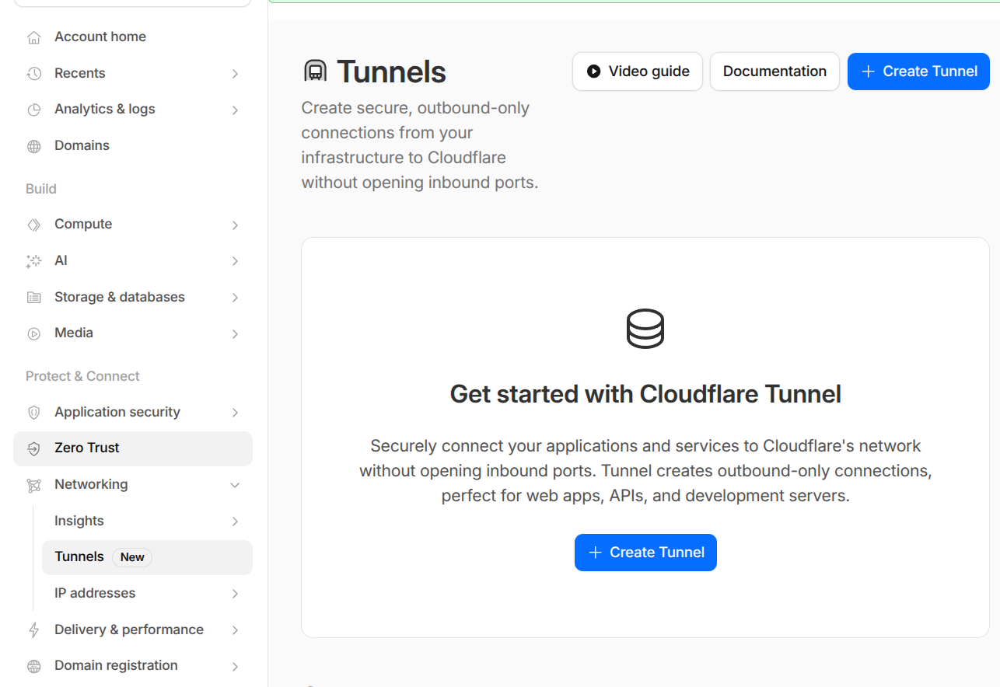

# Cloudflare Tunnel Setup Guide

This document walks through setting up a Cloudflare tunnel (`cloudflared`) to expose
selective cluster services to the internet — while keeping most services **LAN-only** —
and using Cloudflare's DNS API for Let's Encrypt certificate issuance.

## Architecture

```
INTERNET
  │
  ▼
Cloudflare Edge (WAF, DDoS protection, CDN)
  │  HTTPS (Cloudflare manages external TLS)
  ▼
cloudflared pod (in cluster, outbound connection only — no inbound firewall ports needed)
  │  HTTPS to internal service
  ▼
ingress-nginx (192.168.1.81:443)
  │  Routes by Host header
  ▼
echo service (echo.gkcluster.org only)

LOCAL NETWORK
  Clients → router DNS: *.gkcluster.org → 192.168.1.81
           directs to ingress-nginx without going via Cloudflare
           (argocd, headlamp, longhorn, grafana, etc.)
```

**Key design decisions:**

- **Only `echo.gkcluster.org` is in the tunnel.** All other services return 404 from the
  Cloudflare tunnel for external requests. They are reachable from your LAN via a local DNS
  override.
- **DNS-01 challenge for TLS certificates.** Let's Encrypt validates domain ownership by
  looking for a `_acme-challenge` TXT record in Cloudflare DNS. cert-manager automates
  this via the Cloudflare API. This works for **all** hostnames — including LAN-only services
  that have no public HTTP route — making it the correct choice over HTTP-01 here.
- **`cloudflared` uses an outbound connection only.** No inbound firewall ports need to be
  opened on your router. The pod connects outward to Cloudflare's edge network.

---

## Part 1: Cloudflare Web UI Setup

### 1.1 Add your domain to Cloudflare

If your domain is already registered with another registrar, delegate DNS to Cloudflare by
updating the nameservers at your registrar.

1. Log in to the [Cloudflare dashboard](https://dash.cloudflare.com).
2. In 'Account Home' use 'Onboard a Domain' or 'Buy a Domain'.
3. Wait for propagation (usually a few minutes to an hour).

### 1.2 Navigate Tunnels

In the Cloudflare dashboard, click **Networking -> Tunnels** in the sidebar. This is where you will create and manage your tunnels.



### 1.3 Create a tunnel

2. Click **Create a tunnel**.
3. Select **Cloudflared** as the connector type.
4. Name the tunnel (e.g. `gk2`).

[Screenshot: Tunnel creation page — "Select tunnel type" with Cloudflared selected]

5. After creation, Cloudflare shows the **tunnel token**. Copy it — you will need it to create
   the Kubernetes secret in Part 2. The token is a long base64-encoded string.

[Screenshot: Tunnel overview page showing the tunnel token with a "Copy" button]

> **Note:** You can retrieve the token again later in **Zero Trust → Networks → Tunnels →
> click the tunnel name → Configure → Connector token**.

Note the **Tunnel ID** (UUID format, shown on the tunnel details page). You will need it
for `kubernetes-services/additions/cloudflared/values.yaml`.

[Screenshot: Tunnel details page showing Tunnel ID]

### 1.4 Configure a public hostname

Still inside the tunnel configuration, click the **Public Hostname** tab, then
**Add a public hostname**:

| Field | Value |
|---|---|
| Subdomain | `echo` |
| Domain | `gkcluster.org` |
| Type | `HTTPS` |
| URL | `ingress-nginx-controller.ingress-nginx.svc.cluster.local:443` |
| TLS → No TLS Verify | ✅ enabled |

The "No TLS Verify" setting is required because the certificate presented by ingress-nginx
is signed for `echo.gkcluster.org` (a hostname Cloudflare's tunnel resolver doesn't verify
against the internal address).

[Screenshot: "Add a public hostname" form with the values above filled in]

**Do not add public hostnames for argocd, headlamp, longhorn, grafana, or any other service.**
Those are LAN-only — their entries in `cloudflared/values.yaml` have been intentionally
removed. External requests for those hostnames will hit the catch-all and receive a 404.

### 1.5 DNS record created automatically

After saving the public hostname, Cloudflare automatically creates a CNAME DNS record:

```
echo.gkcluster.org  →  <tunnel-id>.cfargotunnel.com   (Proxied ☁)
```

[Screenshot: DNS page showing the echo CNAME record with orange proxy cloud icon]

> All other subdomains (`argocd`, `headlamp`, etc.) should **not** have Cloudflare-proxied
> DNS records. Either delete any auto-created ones or make them **DNS-only** (grey cloud)
> pointing to your LAN IP. For LAN-only services the DNS entries are managed by your router
> — see [Part 3](#part-3-local-dns-for-lan-only-services).

### 1.6 Create an API token for DNS-01 certificate issuance

cert-manager needs to add and remove `_acme-challenge` TXT records in Cloudflare DNS to
prove domain ownership for Let's Encrypt. It does this via a scoped API token.

1. In the Cloudflare dashboard (not Zero Trust), click your **profile icon → My Profile →
   API Tokens**.
2. Click **Create Token**.
3. Click **Use template** next to **Edit zone DNS**.

[Screenshot: API Tokens page with "Create Token" button and "Edit zone DNS" template visible]

4. Configure the token:

| Setting | Value |
|---|---|
| Token name | `cert-manager-dns01` (or similar) |
| Permissions | Zone → DNS → Edit |
| Zone Resources | Include → Specific zone → `gkcluster.org` |
| TTL | Optional — leave blank or set an expiry |

[Screenshot: API token configuration form — permissions set to "Zone DNS Edit" scoped to gkcluster.org]

5. Click **Continue to summary**, then **Create Token**. Copy the token value — it is
   **shown only once**. You will create a Kubernetes secret from it in Part 2.

[Screenshot: Token created confirmation page showing the token value with a warning that it won't be shown again]

---

## Part 2: WAF (Web Application Firewall)

Since only `echo.gkcluster.org` is exposed publicly through the tunnel, the attack surface
is already small. Cloudflare's default WAF rules (DDoS protection, bot management) apply to
all proxied traffic automatically.

You can add an additional rate-limiting rule to prevent abuse of the echo endpoint:

1. In the Cloudflare dashboard for `gkcluster.org`, go to **Security → WAF → Rate Limiting
   Rules**.
2. Click **Create rule** and configure:

| Field | Value |
|---|---|
| Rule name | `Echo rate limit` |
| When incoming requests match… | Hostname equals `echo.gkcluster.org` |
| Rate limit: requests | 30 requests per 1 minute |
| Action | Block (or Managed Challenge) |

[Screenshot: WAF rate limiting rule configuration for echo.gkcluster.org]

---

## Part 3: Local DNS for LAN-only services

For services not exposed via the tunnel (`argocd`, `headlamp`, `longhorn`, `grafana`), your
LAN clients need to resolve their hostnames to the cluster's ingress IP (`192.168.1.81`)
without going via Cloudflare.

Configure your router (or a local DNS server like Pi-hole) to resolve:

```
*.gkcluster.org  →  192.168.1.81
```

Or add individual A records if your router doesn't support wildcard DNS overrides:

```
argocd.gkcluster.org    →  192.168.1.81
headlamp.gkcluster.org  →  192.168.1.81
longhorn.gkcluster.org  →  192.168.1.81
grafana.gkcluster.org   →  192.168.1.81
```

These overrides take priority over public Cloudflare DNS for LAN clients,
routing traffic directly to ingress-nginx without passing through Cloudflare.

> Certificates for these services are still issued via Let's Encrypt DNS-01 and are fully
> trusted by browsers — the LAN routing is transparent to certificate validation.

---

## Part 4: Kubernetes Configuration

### 4.1 Tunnel token secret (cloudflared)

Using the tunnel token copied in Step 1.3:

```bash
kubectl create secret generic cloudflared-credentials \
  --namespace cloudflared \
  --from-literal=TUNNEL_TOKEN=<YOUR_TUNNEL_TOKEN> \
  --dry-run=client -o yaml | \
  kubeseal --controller-namespace kube-system -o yaml > \
  kubernetes-services/additions/cloudflared/tunnel-secret.yaml
```

Then commit and push:

```bash
git add kubernetes-services/additions/cloudflared/tunnel-secret.yaml
git commit -m "Add cloudflared tunnel token SealedSecret"
git push
```

ArgoCD will pick up the change and apply the SealedSecret. sealed-secrets decrypts it
into a plain `cloudflared-credentials` secret that the cloudflared pod reads as
`TUNNEL_TOKEN`.

### 4.2 Cloudflare API token secret (DNS-01)

Using the API token copied in Step 1.6:

```bash
kubectl create secret generic cloudflare-api-token \
  --namespace cert-manager \
  --from-literal=api-token=<YOUR_CLOUDFLARE_API_TOKEN> \
  --dry-run=client -o yaml | \
  kubeseal --controller-namespace kube-system -o yaml > \
  kubernetes-services/additions/cert-manager/cloudflare-api-token-secret.yaml
```

Then commit and push:

```bash
git add kubernetes-services/additions/cert-manager/cloudflare-api-token-secret.yaml
git commit -m "Add cert-manager Cloudflare DNS-01 API token SealedSecret"
git push
```

The `cert-manager` ArgoCD Application already sources the
`kubernetes-services/additions/cert-manager/` directory, so the SealedSecret will be synced
automatically.

### 4.3 Update cloudflared values

Edit `kubernetes-services/additions/cloudflared/values.yaml` and set:

- `tunnelId`: the UUID from Step 1.3
- `tunnelName`: the name you chose (e.g. `gk2`)

The `ingress` section is already configured to expose only `echo.gkcluster.org`. All previous
entries (argocd, headlamp, longhorn, grafana) have been removed.

### 4.4 cert-manager ClusterIssuer

The `ClusterIssuer` in `kubernetes-services/additions/cert-manager/issuer-letsencrypt-prod.yaml`
has been updated to use `dns01` with the Cloudflare API token:

```yaml
solvers:
  - dns01:
      cloudflare:
        apiTokenSecretRef:
          name: cloudflare-api-token
          key: api-token
```

This configuration applies to **all** certificates in the cluster, including those for
LAN-only services. cert-manager will add a temporary `_acme-challenge` TXT record via the
Cloudflare API, wait for Let's Encrypt to validate it, then remove the record.

### 4.5 Echo test service

The echo service is deployed as an ArgoCD Application from
`kubernetes-services/additions/echo/manifests.yaml`. It uses [ealen/echo-server](https://github.com/Ealenn/Echo-Server),
which returns a JSON response showing all incoming request details — useful for verifying
headers, TLS, and routing.

No manual action needed — ArgoCD syncs it automatically after the above secrets are in place.

---

## Part 5: Verification

Once ArgoCD has synced all applications, verify the setup:

### Check certificates

```bash
kubectl get certificate -A
```

All certificates should show `READY: True`. If any show `False`, check the cert-manager logs:

```bash
kubectl logs -n cert-manager deployment/cert-manager | tail -50
```

### Check cloudflared connectivity

```bash
kubectl logs -n cloudflared deployment/cloudflared | tail -30
```

Look for: `Connection registered` and `Registered tunnel connection`. If you see
`failed to connect` or `context deadline exceeded`, check that the `cloudflared-credentials`
secret exists and contains the correct `TUNNEL_TOKEN`.

### Test public access (echo)

```bash
curl https://echo.gkcluster.org
```

Expected: JSON response from ealen/echo-server showing request headers, IP, etc.

### Confirm LAN-only services are NOT publicly accessible

From outside your LAN (e.g. a mobile hotspot), confirm:

```bash
curl -I https://argocd.gkcluster.org
# Expected: 404 from Cloudflare tunnel catch-all (NOT the ArgoCD UI)
```

From inside your LAN:

```bash
curl -I https://argocd.gkcluster.org
# Expected: 200/302 ArgoCD login page (via local DNS → 192.168.1.81)
```

### Check ArgoCD app status

```bash
kubectl get applications -n argo-cd
```

All applications should be `Synced` and `Healthy`. The `cloudflared` and `echo` apps should
be green. If `cert-manager` is `OutOfSync`, it may be waiting for the `cloudflare-api-token`
SealedSecret — ensure Step 4.2 has been completed and pushed.
