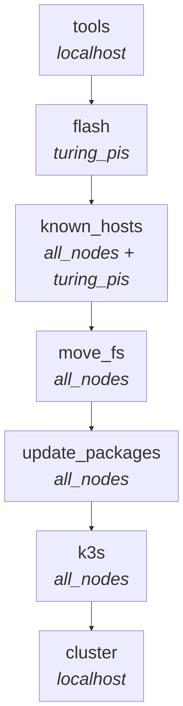

# Ansible Roles in Detail

The playbook `pb_all.yml` runs seven roles in sequence. Each role is fully idempotent —
it checks state before acting and does nothing if the desired state is already achieved.

## Execution order



Each role is tagged with its own name, so you can run individual stages:

```bash
ansible-playbook pb_all.yml --tags tools
ansible-playbook pb_all.yml --tags flash
# etc.
```

The `servers` tag covers both `move_fs` and `update_packages`.

---

## `tools` — CLI tool installation

**Runs on:** localhost (devcontainer)
**Tag:** `tools`

Installs command-line tools needed to manage the cluster:

| Tool | Version | Purpose |
|------|---------|---------|
| `helm` | 3.20.0 | Kubernetes package manager |
| `kubectl` | latest stable | Kubernetes CLI |
| `kubeseal` | 0.35.0 | Sealed Secrets CLI |
| `helm-diff` | plugin | Shows Helm upgrade diffs |

Also creates:

- Shell completions for helm, kubectl (bash + zsh)
- `k` alias for kubectl
- Port-forward helper scripts: `argo.sh`, `grafana.sh`, `dashboard.sh`, `longhorn.sh`
- Sets PATH to include `$BIN_DIR`

The role is split across multiple task files:

- `shell.yml` — PATH, zsh theme
- `helm.yml` — Helm binary + helm-diff plugin
- `kubectl.yml` — kubectl binary + completions
- `kubeseal.yml` — kubeseal binary
- `scripts.yml` — port-forward helper scripts

---

## `flash` — BMC-based OS flashing

**Runs on:** `turing_pis` (BMC hosts)
**Tag:** `flash`
**Guard:** only runs when `do_flash` is true (`-e do_flash=true` or `-e flash_force=true`)

Flashes Ubuntu 24.04 LTS onto Turing Pi compute modules via the BMC's `tpi` CLI.

### How it works

1. **Discover nodes** — looks for the inventory group `<bmc_hostname>_nodes`
   (e.g. `turingpi_nodes` for BMC host `turingpi`).
2. **For each node:**
   - Check if the node is already contactable via SSH (skip if so, unless force).
   - Download the OS image (RK1 or CM4) to `/tmp` on the devcontainer.
   - SCP the image to the BMC at `/mnt/sdcard/images/`.
   - Power off the node.
   - Run `tpi flash --node <slot>` (async, up to 600 seconds).
   - Wait for flash to complete.
3. **Bootstrap cloud-init:**
   - Enter MSD mode (mount the node's eMMC as USB storage on the BMC).
   - Render `cloud.cfg` with the node's hostname and the `ansible` user + SSH key.
   - SCP the config to the node's filesystem.
   - Clear cloud-init cache, reboot, and wait for SSH.

### OS images

| Type | Image | Source |
|------|-------|--------|
| RK1 | Ubuntu 24.04 (rockchip) | `github.com/Joshua-Riek/ubuntu-rockchip` |
| CM4 | Ubuntu 24.04 Server | `cdimage.ubuntu.com` |

### Idempotency

- Node is pinged first — if contactable and `flash_force` is not set, flashing is skipped.
- Images are only downloaded if not already present.

---

## `known_hosts` — SSH host key management

**Runs on:** `all_nodes`, `turing_pis`
**Tag:** `known_hosts`
**Constraint:** `serial: 1` (must not run in parallel)

Updates `~/.ssh/known_hosts` with fresh SSH host keys for each node:

1. Look up the node's IP via `dig`.
2. Remove old entries (by hostname and IP).
3. Scan for current SSH host keys (`ssh-keyscan`).
4. Add the new keys.

:::{warning}
This role must run with `serial: 1` because parallel writes to `~/.ssh/known_hosts`
cause race conditions and file corruption.
:::

---

## `move_fs` — OS migration to NVMe

**Runs on:** `all_nodes`
**Tag:** `servers`
**Guard:** only activates for nodes with `root_dev` defined in the inventory

Migrates the root filesystem from eMMC to NVMe using `ubuntu-rockchip-install`:

1. Check the current root device.
2. If not already on the target device, run `ubuntu-rockchip-install` to the NVMe.
3. Reboot.

:::{note}
eMMC always remains the bootloader for RK1 nodes. Re-flashing via BMC (`tpi flash`)
still works because it writes to eMMC. After a re-flash, the `move_fs` role will
re-migrate to NVMe on the next playbook run.
:::

---

## `update_packages` — OS preparation

**Runs on:** `all_nodes`
**Tag:** `servers`

Prepares each node for K3s:

1. `dpkg --configure -a` (fix any interrupted package operations)
2. `apt dist-upgrade` (full OS upgrade)
3. Reboot if required (kernel updates)
4. `apt autoremove` (clean up)
5. Install required packages:
   - `unattended-upgrades` — automatic security updates
   - `open-iscsi` — required by Longhorn for iSCSI storage
   - `original-awk` — required by some K3s scripts
6. **NVIDIA GPU nodes only** (when `nvidia_gpu_node: true` in inventory):
   - Install `ubuntu-drivers-common` and run `ubuntu-drivers install` to install the GPU driver
   - Add the NVIDIA container toolkit apt repository and install `nvidia-container-toolkit`
   - Write `/var/lib/rancher/k3s/agent/etc/containerd/config.toml.tmpl` with the NVIDIA
     runtime set as the default containerd runtime. k3s regenerates `config.toml` on
     every agent restart from this template, so the configuration persists across reboots.
   - Restart `k3s-agent` to apply the new containerd config

---

## `k3s` — Kubernetes installation

**Runs on:** `all_nodes`
**Tag:** `k3s`

Installs K3s with one control plane node and the rest as workers.

### Control plane (`control.yml`)

- Downloads the K3s install script.
- Runs: `k3s server --disable=traefik --cluster-init`
- Traefik is disabled because this project uses NGINX Ingress.
- `--cluster-init` enables embedded etcd.

### Workers (`worker.yml`)

- Checks if the node is already in the cluster (skip if so, unless force).
- Gets the join token from the control plane.
- Runs the K3s agent installer.
- Labels RK1 nodes with `node-type=rk1` (used by the rkllama DaemonSet selector).
- Creates `/opt/rkllama/models` directory on RK1 nodes.
- Labels NVIDIA GPU nodes with `nvidia.com/gpu.present=true` (when `nvidia_gpu_node: true`
  in inventory). This bootstraps scheduling for the NVIDIA device plugin DaemonSet, which
  then takes over and advertises `nvidia.com/gpu` allocatable resources to the scheduler.

### Kubeconfig (`kubeconfig.yml`)

- Copies `k3s.yaml` from the control plane to `~/.kube/config` on the devcontainer.
- Replaces `127.0.0.1` with the control plane's actual IP.

### Force reinstall

With `-e k3s_force=true`, K3s is uninstalled first (`k3s-uninstall.sh` on control plane,
`k3s-agent-uninstall.sh` on workers), then reinstalled.

---

## `cluster` — ArgoCD and service deployment

**Runs on:** localhost (devcontainer)
**Tag:** `cluster`

Bootstraps ArgoCD and the entire service stack:

1. **Taint the control plane** (multi-node only) — applies `NoSchedule` taint so
   workloads only run on worker nodes. Skipped for single-node clusters.
2. **Install ArgoCD** — deploys the ArgoCD OCI Helm chart (v7.8.3).
3. **Patch ConfigMap** — adds a custom Lua health check for `monitoring.coreos.com/Prometheus`
   (respects a `skip-health-check` annotation).
4. **Create AppProject** — creates the `kubernetes` ArgoCD project allowing access to
   all repos, namespaces, and cluster-scoped resources.
5. **Create root Application** — creates `all-cluster-services` pointing at
   `kubernetes-services/` in the repository. Passes `repo_remote`, `cluster_domain`,
   and `domain_email` as Helm values.
6. **Create ArgoCD Ingress** — creates an Ingress for `argocd.<cluster_domain>` with
   SSL passthrough.

After this role completes, ArgoCD takes over and syncs all services defined in
`kubernetes-services/templates/`.

The `cluster_install_list` variable in `group_vars/all.yml` controls which services
the Ansible role installs directly (currently just `argocd`). Everything else is
managed by ArgoCD once it's running.
