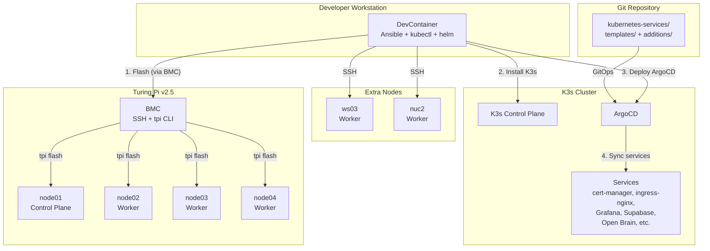
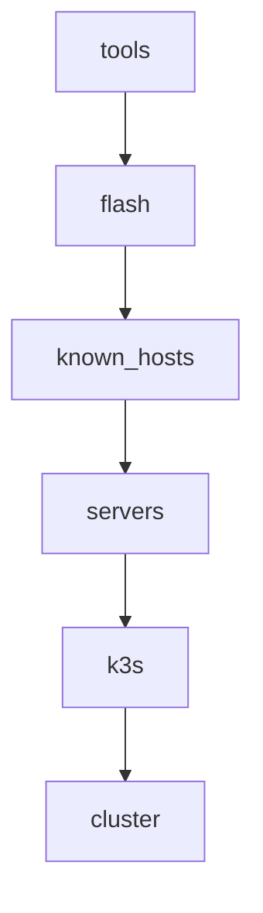
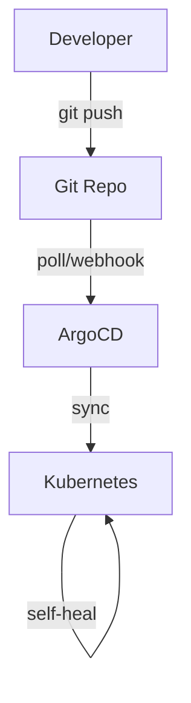

# Architecture

This page describes the overall architecture of the K3s Cluster Commissioning project —
how the pieces fit together from hardware to running services.

## System overview

*The diagram below shows an example topology from the author's cluster. Your
node names and counts will vary.*

## Layers

### Hardware layer

The project supports two types of compute nodes:

- **Turing Pi nodes** — compute modules (RK1, CM4) installed in a Turing Pi v2.5 board.
  The BMC provides remote management (flashing, power control) via SSH and the `tpi` CLI.
- **Extra nodes** — any standalone Linux server (Intel NUC, Raspberry Pi, VM, etc.)
  with a modern Linux distribution and SSH access.

Both types join the same K3s cluster as either the control plane or workers.

### Provisioning layer (Ansible)

Ansible orchestrates the entire setup through a sequence of roles:

| Role | Purpose | Runs on |
|------|---------|---------|
| `tools` | Install helm, kubectl, kubeseal in devcontainer | localhost |
| `flash` | Flash Ubuntu to Turing Pi compute modules via BMC | BMC hosts |
| `known_hosts` | Update SSH known_hosts (serial: 1) | All hosts |
| `move_fs` | Migrate OS from eMMC to NVMe | Nodes with `root_dev` |
| `update_packages` | dist-upgrade, install dependencies | All nodes |
| `k3s` | Install K3s control plane and workers | All nodes |
| `cluster` | Deploy ArgoCD, bootstrap services | localhost |

Each role is idempotent — it checks state before acting and does nothing if the desired
state is already achieved.

### Kubernetes layer (K3s)

[K3s](https://k3s.io/) is a lightweight, CNCF-certified Kubernetes distribution. This
project uses it because:

- **Lightweight** — single binary, low resource footprint, ideal for ARM SBCs
- **Batteries included** — built-in CoreDNS, metrics-server, local-path provisioner
- **Simple** — easy to install, upgrade, and uninstall

Notable configuration:

- **Traefik is disabled** — K3s ships Traefik by default, but this project uses
  NGINX Ingress instead (`--disable=traefik`)
- **Control plane is tainted** (multi-node only) — `NoSchedule` taint prevents
  workloads from running on the control plane node; skipped for single-node clusters
- **etcd mode** — single control plane with `--cluster-init` (embedded etcd)

### GitOps layer (ArgoCD)

After Ansible installs ArgoCD, all further service management is done via Git:

ArgoCD continuously reconciles the cluster state with the repository. See
{doc}`gitops-flow` for a detailed explanation.

## Why these choices?

| Choice | Rationale |
|--------|-----------|
| K3s over K8s | Lightweight, single binary, ideal for ARM and small clusters |
| ArgoCD over Flux | Mature, excellent UI, widely adopted |
| NGINX Ingress over Traefik | More widely documented, better TLS passthrough support |
| Static `local-nvme` PVs + NFS backup CronJobs over distributed block storage | Lower overhead, simpler failure modes, known host pinning; the NAS was already present so backups reuse existing infrastructure |
| cert-manager + DNS-01 | Works for LAN-only services that have no public HTTP route |
| Sealed Secrets over SOPS | Kubernetes-native, no external key management needed |
| DevContainer over bare metal | Reproducible execution environment, zero host contamination |
