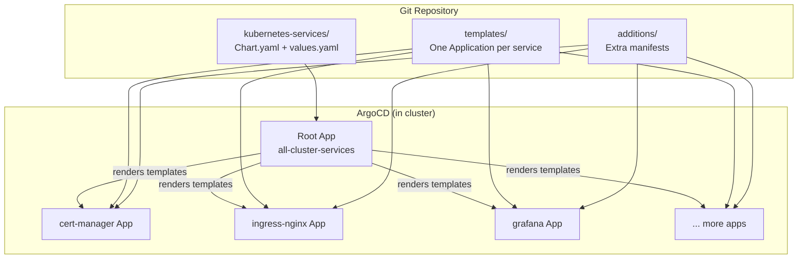
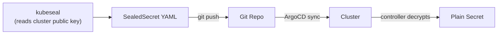

# GitOps Flow

This project follows the **GitOps** model: the Git repository is the single source of
truth for all cluster configuration. ArgoCD continuously reconciles the cluster state
with what is defined in the repository.

## The golden rule

**Never modify cluster resources directly.**

Any change made via `kubectl apply`, `kubectl patch`, or `kubectl edit` will either:

- Be **immediately reverted** by ArgoCD's self-heal, or
- Create **drift** that obscures the true state of the system

The correct workflow for any fix is always:

1. Edit the relevant file(s) in the repository.
2. `git commit` and `git push`.
3. ArgoCD detects the change and reconciles the cluster automatically.

## How ArgoCD manages state



### The app-of-apps pattern

The `cluster` Ansible role installs ArgoCD and creates a single root Application called
`all-cluster-services`. This root app points at the `kubernetes-services/` directory in
the repository — which is a Helm chart.

When ArgoCD renders this Helm chart, each template in `kubernetes-services/templates/`
becomes a **child ArgoCD Application**. Each child independently syncs its own Helm chart
or raw manifests.

### Sync policies

All child Applications are configured with:

```yaml
syncPolicy:
  automated:
    prune: true      # Delete resources removed from Git
    selfHeal: true   # Revert manual changes to match Git
  syncOptions:
    - CreateNamespace=true
```

- **Auto-sync** — ArgoCD applies changes within seconds of detecting a Git change
- **Prune** — resources deleted from Git are automatically removed from the cluster
- **Self-heal** — manual changes to managed resources are reverted to match Git
- **CreateNamespace** — namespaces are created automatically if they don't exist

## The one exception: Sealed Secrets

`kubeseal` reads the cluster's public key to encrypt secrets. This is the one operation
that necessarily interacts with the live cluster. However, the resulting SealedSecret
YAML is committed to Git — so it still follows the GitOps flow:



## Read-only kubectl is fine

The only legitimate `kubectl` commands during normal operation are **read-only**:

```bash
kubectl get pods -A
kubectl logs -n monitoring deployment/grafana
kubectl describe node node02
kubectl get applications -n argo-cd
```

These commands inspect cluster state without modifying it.

## What if ArgoCD is down?

If ArgoCD itself is broken, the `cluster` Ansible role can reinstall it:

```bash
ansible-playbook pb_all.yml --tags cluster -e cluster_force=true
```

Once ArgoCD is back, it re-syncs all services from Git automatically.
