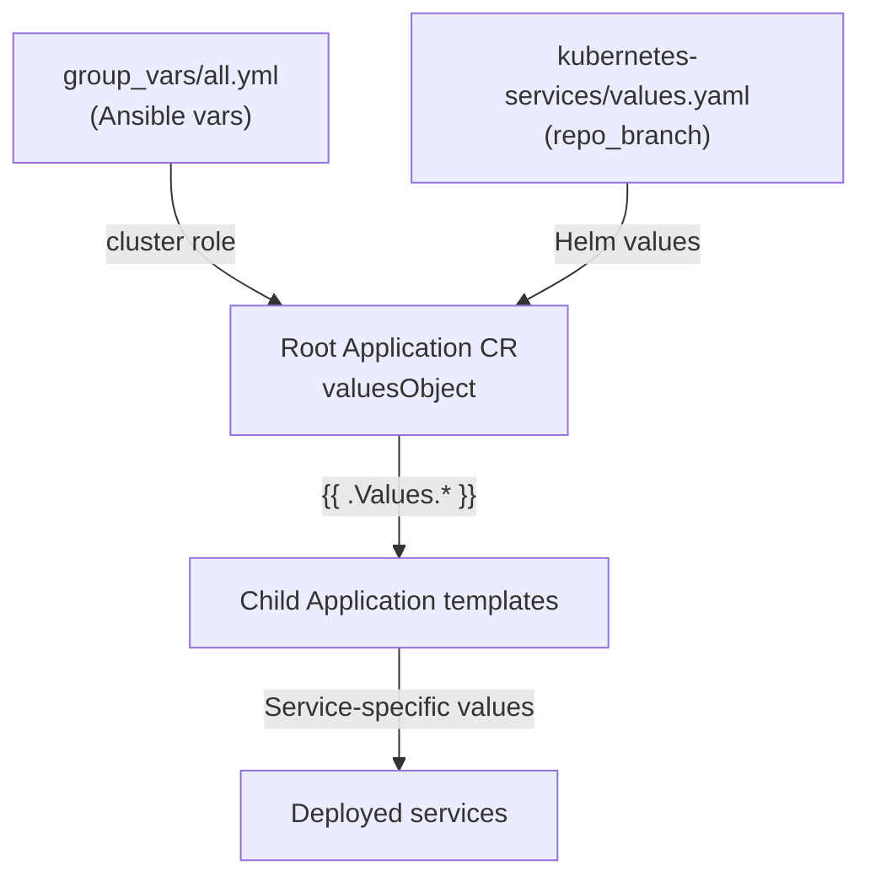

# Kubernetes Services Structure

All cluster services are managed through a single **meta Helm chart** in the
`kubernetes-services/` directory. ArgoCD deploys this chart, and each template
within it becomes an independent ArgoCD Application.

## Directory layout

```
kubernetes-services/
├── Chart.yaml              # Minimal Helm chart metadata
├── values.yaml             # Shared values (repo_branch, admin_emails, viewer_emails, etc.)
├── templates/              # One ArgoCD Application per service
│   ├── backups.yaml
│   ├── cert-manager.yaml
│   ├── cloudflared.yaml
│   ├── dashboard.yaml      # Headlamp
│   ├── echo.yaml
│   ├── grafana.yaml
│   ├── ingress.yaml
│   ├── kernel-settings.yaml
│   ├── llamacpp.yaml
│   ├── local-storage.yaml
│   ├── nvidia-device-plugin.yaml
│   ├── oauth2-proxy.yaml
│   ├── open-webui.yaml
│   ├── rkllama.yaml
│   └── sealed-secrets.yaml
└── additions/              # Extra manifests per service
    ├── argocd/             # Custom CM for ArgoCD health checks
    ├── backups/            # CronJobs + single NFS PV for per-app backups
    ├── cert-manager/       # SealedSecret + ClusterIssuer
    ├── cloudflared/        # Deployment + SealedSecret
    ├── dashboard/          # RBAC for Headlamp
    ├── echo/               # Echo-server manifests
    ├── ingress/            # Reusable ingress sub-chart
    ├── llamacpp/           # NFS volume + GPU config
    ├── local-storage/      # local-nvme StorageClass + static per-workload PVs
    ├── oauth2-proxy/       # SealedSecret for OAuth config
    └── rkllama/            # DaemonSet + ConfigMap + Ingress + Service
```

## How it works

### The root Application

The Ansible `cluster` role creates a root ArgoCD Application called
`all-cluster-services`. It points at `kubernetes-services/` and passes shared
values via Helm:

- `repo_remote` — Git repository URL
- `repo_branch` — comes from `kubernetes-services/values.yaml` (self-referential)
- `cluster_domain` — domain name for ingress hosts
- `domain_email` — for Let's Encrypt registration

### Template rendering

ArgoCD renders the Helm chart. Each file in `templates/` produces an ArgoCD
`Application` resource. These are **child apps** — each one independently manages
its own service lifecycle.

### Multi-source Applications

Most services use the **multi-source** pattern — combining an external Helm chart
with local additions from this repo:

```yaml
sources:
  # Source 1: External Helm chart
  - repoURL: https://charts.jetstack.io
    targetRevision: "v1.19.3"
    chart: cert-manager
    helm:
      valuesObject:
        crds:
          enabled: true

  # Source 2: Local additions (SealedSecrets, ClusterIssuers, etc.)
  - repoURL: "{{ .Values.repo_remote }}"
    targetRevision: "{{ .Values.repo_branch }}"
    path: kubernetes-services/additions/cert-manager

  # Source 3: Reusable ingress sub-chart (optional)
  - repoURL: "{{ .Values.repo_remote }}"
    targetRevision: "{{ .Values.repo_branch }}"
    path: kubernetes-services/additions/ingress
    helm:
      valuesObject:
        cluster_domain: "{{ .Values.cluster_domain }}"
        service_name: cert-manager
        service_port: 443
```

### The reusable ingress sub-chart

The `additions/ingress/` directory contains a minimal Helm chart that generates
a standardised Ingress resource. It supports:

- TLS via the `letsencrypt-prod` ClusterIssuer
- Host-based routing (`<service_name>.<cluster_domain>`)
- `basic_auth: true` — nginx basic-auth via the `admin-auth` secret
- `oauth2_proxy: true` — protect with oauth2-proxy authentication gateway
- `ssl_redirect: false` — disable HTTP→HTTPS redirect (default true)
- `ssl_passthrough: true` — TLS passthrough mode (unused since ArgoCD
  moved to nginx-terminated TLS)

This avoids duplicating ingress boilerplate across services.

### Plain manifest services

Some services (echo, cloudflared, rkllama) don't use external Helm charts — they
deploy raw Kubernetes manifests directly from `additions/<service>/`. The ArgoCD
Application simply points at the directory.

## Values flow



Key values propagated to all child apps:

| Value | Source | Purpose |
|-------|--------|---------|
| `repo_remote` | `group_vars/all.yml` | Git repo URL for multi-source apps |
| `repo_branch` | `kubernetes-services/values.yaml` | Branch for `targetRevision` |
| `cluster_domain` | `group_vars/all.yml` | Domain for ingress hosts |
| `domain_email` | `group_vars/all.yml` | Let's Encrypt email |

## Storage layer: `local-storage` and `backups`

Two special services implement the cluster's stateful-data strategy:

- **`local-storage`** (`templates/local-storage.yaml`,
  `additions/local-storage/`) — creates the `local-nvme` `StorageClass`
  (`no-provisioner`, `WaitForFirstConsumer`, `Retain`) plus one static
  `PersistentVolume` per stateful workload, each pre-bound to the
  consuming `PersistentVolumeClaim` via `spec.claimRef` and pinned to a
  specific node via `spec.nodeAffinity`. Sync wave `-5` ensures the SC
  and PVs exist before the stateful charts try to create their PVCs.
  On-disk backing lives at `/home/k8s-data/*` (nuc2) and
  `/var/lib/k8s-data/*` (RK1 nodes) — directories created idempotently
  by the `k8s_data_dirs` Ansible role and **preserved by default** on
  decommission (see {doc}`../how-to/backup-restore`).

- **`backups`** (`templates/backups.yaml`, `additions/backups/`) — one
  namespace, one static NFS `PersistentVolume` pointing at
  `<nas>:/bigdisk/k8s-cluster`, one namespace-scoped `PVC`, and a fleet
  of `CronJob`s (one daily + one weekly per stateful app). Each CronJob
  mounts the shared PVC with a workload-specific `subPath` so it only
  sees `backups/<app>/{,weekly}/`. The NFS share itself is created
  manually on the NAS via {doc}`../how-to/nas-setup` — Ansible has no
  access to the NAS.

Together these give you per-rebuild data survival (local PVs) **plus**
off-cluster point-in-time backups (NFS CronJobs), without the
operational overhead of a replicated CSI driver.

## Renovate integration

[Renovate](https://docs.renovatebot.com/) monitors `kubernetes-services/templates/*.yaml`
for `targetRevision` fields and automatically creates pull requests when upstream Helm
charts release new versions. See `renovate.json` for the full configuration.
