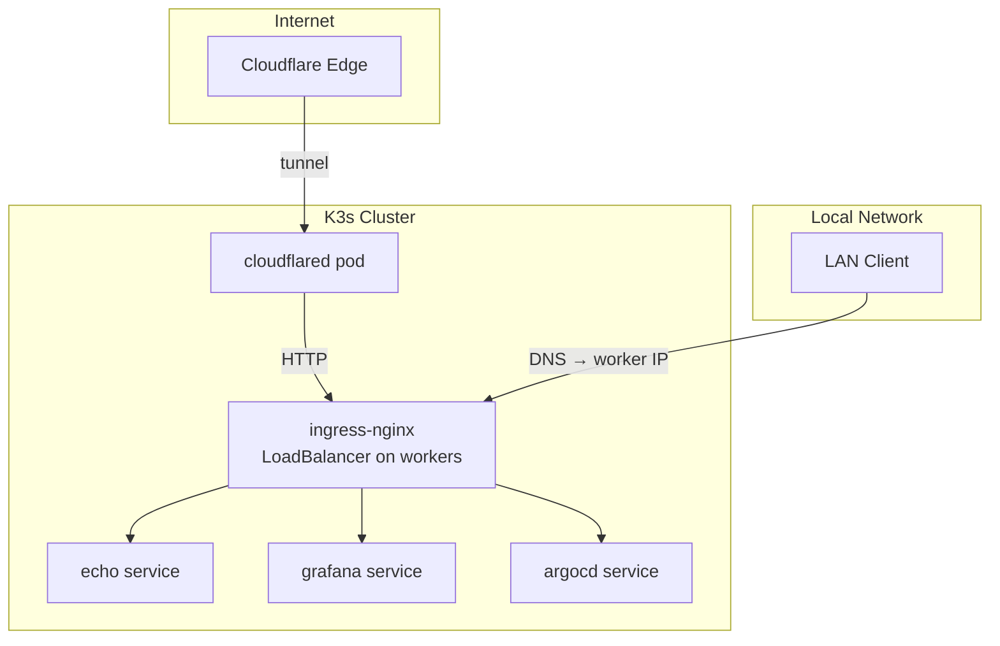
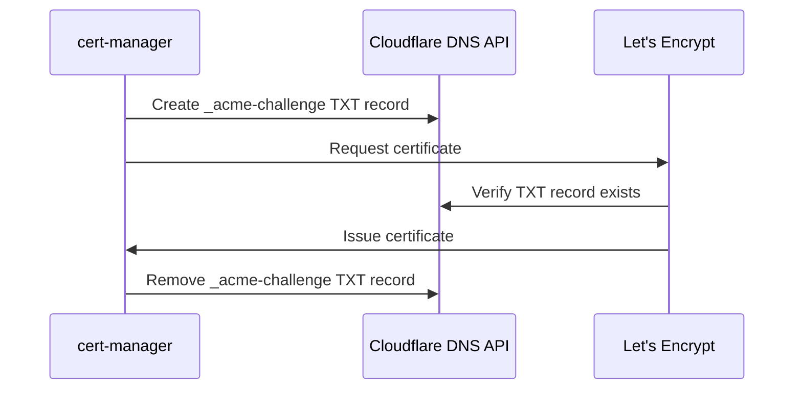

# Networking

This page explains the networking architecture: how traffic reaches cluster services,
TLS certificate issuance, and the Cloudflare tunnel integration.

## Ingress architecture



### NGINX Ingress (not Traefik)

K3s ships Traefik as its default ingress controller, but this project disables it
(`--disable=traefik`) and deploys **ingress-nginx** instead. Reasons:

- More widely documented in the Kubernetes ecosystem
- Better support for TLS passthrough (needed for ArgoCD)
- More straightforward configuration model

### LoadBalancer on workers

The ingress-nginx controller runs on **worker nodes** (in multi-node clusters the
control plane has a `NoSchedule` taint). DNS entries for all services must point to
worker node IPs, not the control plane. For single-node clusters, DNS points to that
single node.

For round-robin across workers:

```
*.example.com  A  192.168.1.82
*.example.com  A  192.168.1.83
*.example.com  A  192.168.1.84
```

A single worker IP also works — kube-proxy routes traffic to the ingress pod
regardless of which worker receives the connection.

## TLS certificates

### cert-manager + Let's Encrypt DNS-01

All TLS certificates are automatically issued by [Let's Encrypt](https://letsencrypt.org/)
via [cert-manager](https://cert-manager.io/). The project uses **DNS-01** validation
(not HTTP-01):



**Why DNS-01 over HTTP-01?**

- Works for **LAN-only services** that have no public HTTP route
- Works for wildcard certificates
- Doesn't require inbound port 80 to be open

The Cloudflare API token for DNS management is stored as a SealedSecret at
`kubernetes-services/additions/cert-manager/cloudflare-api-token-secret.yaml`.

### Certificate lifecycle

cert-manager automatically:

- Creates certificates for each Ingress resource
- Renews certificates before expiry (default: 30 days before)
- Stores certificates as Kubernetes Secrets

## Cloudflare tunnel

For services exposed to the internet, a [Cloudflare Tunnel](https://developers.cloudflare.com/cloudflare-one/connections/connect-networks/)
provides secure access without opening inbound firewall ports.

### How it works

1. A `cloudflared` pod in the cluster makes an **outbound** connection to Cloudflare's
   edge network.
2. Cloudflare routes incoming requests for tunnel-registered hostnames through this
   connection.
3. The `cloudflared` pod forwards requests to ingress-nginx via HTTP.

### Public vs LAN-only services

| Service type | DNS record | Access |
|-------------|-----------|--------|
| Public (e.g. echo) | Proxied CNAME via tunnel | Internet + LAN |
| LAN-only (e.g. grafana) | Grey-cloud A record → worker IP | LAN only |

Public services get Cloudflare's full protection: WAF, DDoS mitigation, CDN. LAN-only
services resolve to private RFC-1918 addresses that are only reachable from the local
network.

### Why no wildcard DNS?

A proxied wildcard `*` CNAME in Cloudflare causes Chrome to attempt ECH (Encrypted
Client Hello) via Cloudflare's edge for every subdomain — including LAN-only services
that have no Cloudflare certificate. This results in
`ERR_ECH_FALLBACK_CERTIFICATE_INVALID`.

Instead, each service gets an explicit DNS record: either a proxied tunnel CNAME
(public) or a grey-cloud A record (LAN-only).

## ArgoCD SSL passthrough

ArgoCD's gRPC API uses TLS natively. The ArgoCD Ingress is configured with
`nginx.ingress.kubernetes.io/ssl-passthrough: "true"` — NGINX terminates the TCP
connection but passes TLS directly to the ArgoCD server on port 443.

This means ArgoCD handles its own TLS certificate and the ingress does not decrypt
traffic.
