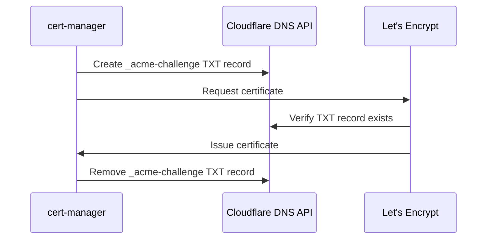

# Networking

This page explains cluster routing and TLS: how TLS certificates are issued,
how the Cloudflare tunnel provides external access, and how ArgoCD terminates
TLS at the ingress. The ingress-nginx routing architecture itself — which is
the entry point for Layer 2 authentication — lives in
{doc}`authentication` under "Ingress architecture".

## TLS certificates

### cert-manager + Let's Encrypt DNS-01

All TLS certificates are automatically issued by [Let's Encrypt](https://letsencrypt.org/)
via [cert-manager](https://cert-manager.io/). The project uses **DNS-01** validation
(not HTTP-01):

**Why DNS-01 over HTTP-01?**

- Works for **LAN-only services** that have no public HTTP route
- Works for wildcard certificates
- Doesn't require inbound port 80 to be open

The Cloudflare API token for DNS management is stored as a SealedSecret at
`kubernetes-services/additions/cert-manager/templates/cloudflare-api-token-secret.yaml`.

### Certificate lifecycle

cert-manager automatically:

- Creates certificates for each Ingress resource
- Renews certificates before expiry (default: 30 days before)
- Stores certificates as Kubernetes Secrets

## Cloudflare tunnel

For services exposed to the internet, a [Cloudflare Tunnel](https://developers.cloudflare.com/cloudflare-one/connections/connect-networks/)
provides secure access without opening inbound firewall ports.

### How it works

1. A `cloudflared` pod in the cluster makes an **outbound** connection to Cloudflare's
   edge network.
2. Cloudflare routes incoming requests for tunnel-registered hostnames through this
   connection.
3. The `cloudflared` pod forwards requests to ingress-nginx via HTTP.

### Public vs LAN-only services

| Service type | DNS record | Access |
|-------------|-----------|--------|
| Public (e.g. echo) | Proxied CNAME via tunnel | Internet + LAN |
| LAN-only (e.g. grafana) | Grey-cloud A record → worker IP | LAN only |

Public services get Cloudflare's full protection: WAF, DDoS mitigation, CDN. LAN-only
services resolve to private RFC-1918 addresses that are only reachable from the local
network.

### Why no wildcard DNS?

A proxied wildcard `*` CNAME in Cloudflare causes Chrome to attempt ECH (Encrypted
Client Hello) via Cloudflare's edge for every subdomain — including LAN-only services
that have no Cloudflare certificate. This results in
`ERR_ECH_FALLBACK_CERTIFICATE_INVALID`.

Instead, each service gets an explicit DNS record: either a proxied tunnel CNAME
(public) or a grey-cloud A record (LAN-only).

## ArgoCD TLS termination

ArgoCD runs with `server.insecure: true`, serving plain HTTP internally.
TLS is terminated at the nginx ingress using a Let's Encrypt certificate
(the same pattern as every other service). This allows ArgoCD to be routed
through the Cloudflare tunnel and protected by Cloudflare Access.
