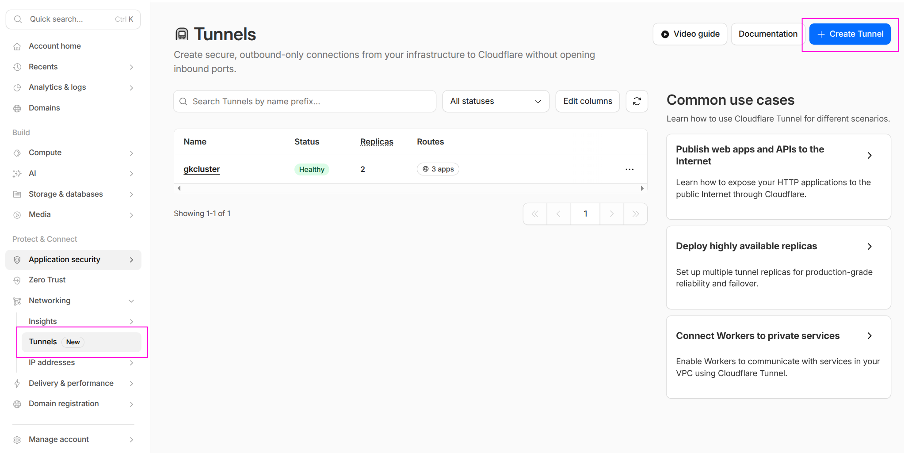
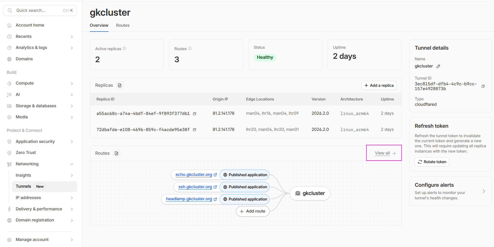
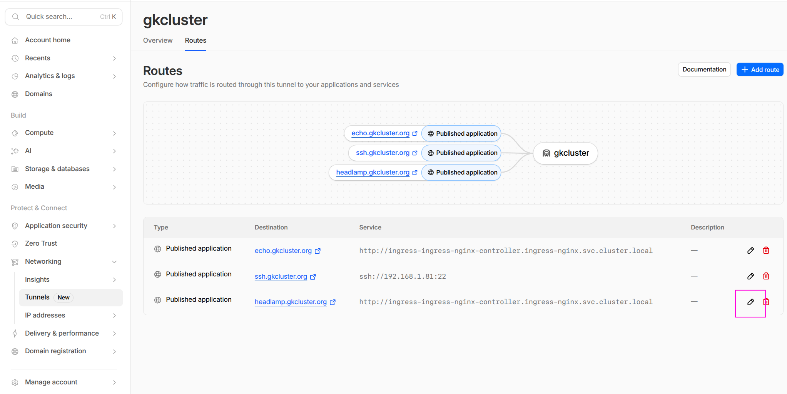
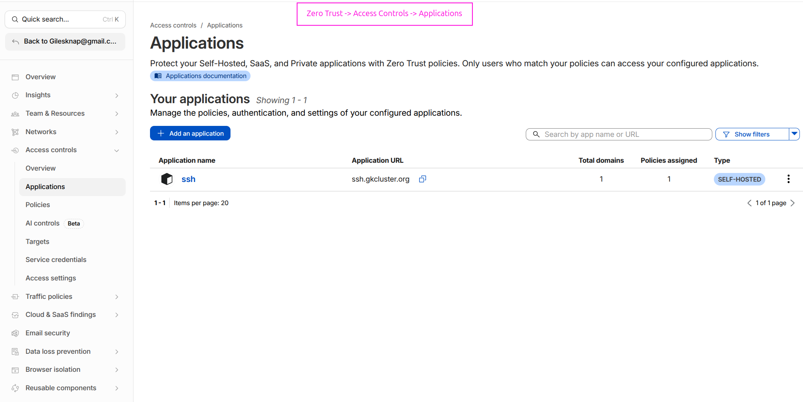
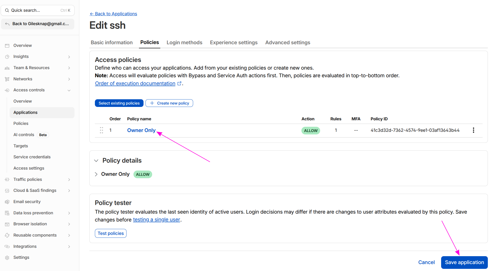
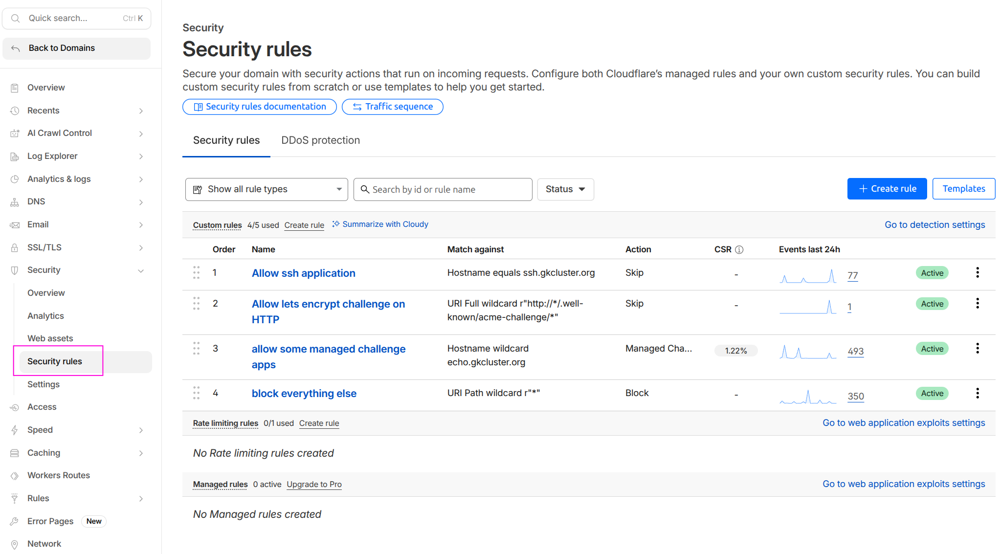

# Set Up a Cloudflare SSH Tunnel for Remote Cluster Access

This guide walks through setting up secure remote access to your K3s cluster via an
SSH tunnel through Cloudflare Zero Trust, without opening any inbound firewall ports.

## Architecture

```
CLIENT MACHINE
  │
  cloudflared access ssh --hostname ssh.example.com
  │  HTTPS to Cloudflare Edge (authenticated via Zero Trust policy)
  ▼
Cloudflare Zero Trust (identity verification + audit logging)
  │  Existing outbound tunnel
  ▼
cloudflared pod (in cluster)
  │  Forwards to node01:22
  ▼
node01 (<node01-ip>) SSH
  │
  kubectl / port-forward to any cluster service
```

**Key security properties:**

- No inbound firewall ports are opened — `cloudflared` makes outbound connections only.
- Cloudflare Access enforces identity verification (e.g. email OTP, GitHub, Google)
  **before** any SSH session is established.
- All access attempts are logged in the Cloudflare Access audit trail.
- Optionally, short-lived SSH certificates replace static keys entirely.

## Notes on cloudflare

<https://one.dash.cloudflare.com> is specifically designed for managing Cloudflare Zero Trust and network security services (formerly Cloudflare for Teams), while <https://dash.cloudflare.com> remains the primary dashboard for managing DNS, WAF, and general website performance.














## Prerequisites

- A working Cloudflare Tunnel with `cloudflared` deployed in the cluster
  (see [Set Up a Cloudflare Tunnel](cloudflare-tunnel.md)).
- SSH enabled on `node01` (it is by default after Ansible provisioning).
- `cloudflared` installed on your **client machine**:

```bash
# macOS
brew install cloudflare/cloudflare/cloudflared

# Linux (Debian/Ubuntu) — install latest release directly
curl -L --output /tmp/cloudflared.deb \
  https://github.com/cloudflare/cloudflared/releases/latest/download/cloudflared-linux-amd64.deb
sudo dpkg -i /tmp/cloudflared.deb
```

## Part 1: Cloudflare Zero Trust — Access Application

This is the critical security gate. Without it, anyone with your DNS name could
attempt connections.

### 1.1 Create an Access Application

1. Go to [one.dash.cloudflare.com](https://one.dash.cloudflare.com/) (the Cloudflare One dashboard — separate from the main Cloudflare dashboard).
2. Navigate to **Access controls → Applications**.
3. Select **Add an application → Self-hosted**.
4. Configure as follows, then click **Add public hostname**:

| Field | Value |
|---|---|
| Application name | `k3s SSH` |
| Session duration | `24h` |
| Domain | `example.com` |
| Subdomain | `ssh` |
| Path | none (leave blank) |

4. Click **Save**.

### 1.2 Add an Access Policy

| Field | Value |
|---|---|
| Policy name | `Owner only` |
| Action | `Allow` |
| Include rule | Emails → `your@email.com` |

:::{warning}
Keep this policy as restrictive as possible — ideally a single email address or a
specific identity provider group. This policy is the primary security boundary.
:::

5. Click **Save**.

## Part 2: Tunnel Public Hostname for SSH

In the Cloudflare One dashboard ([one.dash.cloudflare.com](https://one.dash.cloudflare.com/)),
go to **Networks → Tunnels**, open your existing tunnel, select **Public hostnames → Add a public hostname**:

| Field | Value |
|---|---|
| Subdomain | `ssh` |
| Domain | `example.com` |
| Service Type | `SSH` |
| Service URL | `<node01-ip>:22` |

:::{note}
The Service field is split into a **Type** dropdown and a **URL** field. Select `SSH`
from the Type dropdown and enter `<node01-ip>:22` in the URL field — do not include
the `ssh://` prefix in the URL field.
:::

Cloudflare automatically creates a proxied CNAME:

```
ssh.example.com → <tunnel-id>.cfargotunnel.com  (Proxied ☁)
```

:::{note}
The `cloudflared` pod resolves `<node01-ip>` from within the cluster network — it does
not need a DNS name, just a reachable IP. Using the control-plane IP directly is more
reliable than a hostname here.
:::

## Part 3: WAF Skip Rule

By default Cloudflare's WAF inspects all proxied traffic and may block requests to
`ssh.example.com` before they ever reach the Access application — resulting in a
generic "Why have I been blocked?" page and `failed to find Access application` from
`cloudflared`. You must add a WAF skip rule to allow Access to handle authentication.

In the **main Cloudflare dashboard** (`dash.cloudflare.com`, not the One dashboard):

1. Select your `example.com` zone.
2. Go to **Security → WAF → Custom rules → Create rule**.
3. Configure:

| Field | Value |
|---|---|
| Rule name | `Allow SSH tunnel` |
| Expression | `http.host eq "ssh.example.com"` |
| Action | `Skip` |

4. Under **Skip**, tick:
   - Skip all remaining **custom rules**
   - Skip all **managed rules** (WAF Managed Ruleset)
5. Click **Deploy**.

:::{warning}
Without this rule, `cloudflared access login` returns
`failed to find Access application` and visiting `ssh.example.com` in a browser
shows a WAF block page rather than the Cloudflare Access login prompt. The WAF
intercepts the request before Access can issue its authentication challenge.
:::

## Part 4: Client SSH Configuration

### 4.1 Add a ProxyCommand entry to `~/.ssh/config`

```text
Host ssh.example.com
    ProxyCommand cloudflared access ssh --hostname %h
    User ubuntu
    StrictHostKeyChecking no
```

### 4.2 Authenticate before first connection

The `ProxyCommand` does **not** open a browser automatically. You must log in first
to cache a token:

```bash
cloudflared access login https://ssh.example.com
```

This opens a browser window for Cloudflare Access authentication. After authenticating,
a token is written to `~/.cloudflared/`. The token is reused for the session duration
you configured.

:::{warning}
Parts 1 (Access Application), 2 (Tunnel public hostname), and 3 (WAF skip rule) must
all be completed before this command will work. If any is missing you will see:

- `failed to find Access application` — either the Access Application (Part 1) does not
  exist, the hostname does not exactly match `ssh.example.com`, or the WAF (Part 3)
  is blocking the request before Access can respond. Check
  **Access controls → Applications** at [one.dash.cloudflare.com](https://one.dash.cloudflare.com/)
  and **Security → WAF → Custom rules** at [dash.cloudflare.com](https://dash.cloudflare.com/).
- `websocket: bad handshake` — the tunnel hostname in Part 2 is missing, so
  Cloudflare has nowhere to forward the connection. Check **Networks → Tunnels → Public hostnames**.
:::

### 4.3 Connect via SSH

```bash
ssh ssh.example.com
```

Subsequent connections within the token's session duration connect immediately without
re-authentication. When the token expires, re-run `cloudflared access login` first.

## Part 5: Remote `kubectl` Access

### 5.1 Copy and patch your kubeconfig

```bash
# Copy kubeconfig from the control plane
scp ssh.example.com:~/.kube/config ~/.kube/k3s-remote.yaml

# Patch the server address to use a local forwarded port
sed -i 's|https://<node01-ip>:6443|https://127.0.0.1:6443|' \
    ~/.kube/k3s-remote.yaml
```

### 5.2 Forward the Kubernetes API port and use kubectl

```bash
# Start the port forward in the background
ssh -fNL 6443:<node01-ip>:6443 ssh.example.com

# Use the remote kubeconfig
export KUBECONFIG=~/.kube/k3s-remote.yaml
kubectl get nodes
```

Expected output: your cluster nodes in `Ready` state.

## Part 6: Access Cluster Web Services Remotely

Use SSH local port-forwarding to reach any cluster web service. The forwarding target
is resolved from `node01` — so you can use internal cluster DNS or LAN IPs.

```bash
# Single service — ArgoCD UI
ssh -fNL 8080:<worker-ip>:443 ssh.example.com
# Open: https://localhost:8080

# Multiple services in one connection
ssh -fNL 8080:<worker-ip>:443 \
    -NL 8081:<worker-ip>:443 \
    ssh.example.com
```

Or use `kubectl port-forward` once your tunnel API connection is active:

```bash
# Forward ArgoCD (already connected via Part 4)
kubectl port-forward svc/argocd-server -n argo-cd 8080:443 &

# Forward Grafana
kubectl port-forward svc/grafana -n monitoring 8081:80 &
```

| Service | Forwarded URL |
|---------|--------------|
| ArgoCD | `https://localhost:8080` |
| Grafana | `http://localhost:8081` |
| Headlamp | adjust port as needed |

:::{tip}
Create a shell script or alias to bring up all your port forwards in one command:

```bash
#!/usr/bin/env bash
# remote-cluster.sh — bring up tunnel port forwards
ssh -fNL 6443:<node01-ip>:6443 ssh.example.com
echo "Kubernetes API → https://127.0.0.1:6443"
kubectl --kubeconfig ~/.kube/k3s-remote.yaml port-forward \
    svc/argocd-server -n argo-cd 8080:443 &
echo "ArgoCD → https://localhost:8080"
```
:::

## Part 7: Verification

### Confirm Access policy is enforced

Visit `https://ssh.example.com` in a browser — you should be redirected to the
Cloudflare Access login page, not an SSH banner. If you see a plain error page,
check **Access controls → Applications** at [one.dash.cloudflare.com](https://one.dash.cloudflare.com/)
to confirm the application exists and its hostname matches.

### Test the SSH tunnel

```bash
ssh ssh.example.com echo "tunnel ok"
```

Expected: `tunnel ok` printed after authentication.

### Check `cloudflared` logs in the cluster

```bash
kubectl logs -n cloudflared deployment/cloudflared | tail -20
```

Look for connections referencing `ssh.example.com`.

### Confirm the node is NOT directly reachable from outside your LAN

From a mobile hotspot (off your home network):

```bash
ssh ubuntu@<node01-ip>
# Expected: connection refused or timeout — direct access is blocked
```

The node is only reachable via the Cloudflare tunnel with a valid Access session.

## See also

- {doc}`cloudflare-tunnel` — Setting up the base Cloudflare tunnel
- {doc}`oauth-setup` — In-cluster OAuth authentication as an alternative to
  Cloudflare Access
