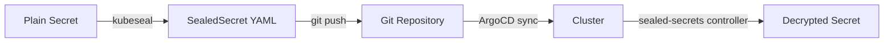

# Manage Sealed Secrets

This project uses [Sealed Secrets](https://sealed-secrets.netlify.app/) to store
encrypted secrets in the Git repository. The `sealed-secrets` controller in the
cluster decrypts them at deploy time.

## How it works



1. You create a standard Kubernetes Secret (dry-run, not applied to the cluster).
2. `kubeseal` encrypts it using the cluster's public key — only that specific cluster
   can decrypt it.
3. The resulting `SealedSecret` YAML is safe to commit to Git.
4. ArgoCD syncs the SealedSecret to the cluster.
5. The sealed-secrets controller decrypts it into a regular Secret.

## Prerequisites

- `kubeseal` is installed in the devcontainer (via the `tools` role)
- The `sealed-secrets` controller is running in the cluster (deployed by ArgoCD)
- `kubectl` has access to the cluster (kubeconfig configured)

## Create a new SealedSecret

### From a literal value

```bash
# Prompt for the secret value (not echoed, not stored in shell history)
printf 'Secret value: ' && read -rs SECRET_VALUE && echo

# Create the SealedSecret
printf '%s' "$SECRET_VALUE" | \
  kubectl create secret generic my-secret-name \
    --namespace my-namespace \
    --from-file=my-key=/dev/stdin \
    --dry-run=client -o yaml | \
  kubeseal --controller-name sealed-secrets \
    --controller-namespace kube-system -o yaml > \
    kubernetes-services/additions/my-service/my-secret.yaml

unset SECRET_VALUE
```

### From a file

```bash
kubectl create secret generic my-secret-name \
  --namespace my-namespace \
  --from-file=my-key=path/to/secret-file \
  --dry-run=client -o yaml | \
kubeseal --controller-name sealed-secrets \
  --controller-namespace kube-system -o yaml > \
  kubernetes-services/additions/my-service/my-secret.yaml
```

### With multiple keys

```bash
kubectl create secret generic my-secret-name \
  --namespace my-namespace \
  --from-literal=username=admin \
  --from-literal=password=supersecret \
  --dry-run=client -o yaml | \
kubeseal --controller-name sealed-secrets \
  --controller-namespace kube-system -o yaml > \
  kubernetes-services/additions/my-service/my-secret.yaml
```

## Commit and deploy

```bash
git add kubernetes-services/additions/my-service/my-secret.yaml
git commit -m "Add my-secret SealedSecret"
git push
```

ArgoCD syncs the SealedSecret automatically.

## Existing SealedSecrets in this project

| Secret | Namespace | File | Purpose |
|--------|-----------|------|---------|
| `cloudflared-credentials` | `cloudflared` | `additions/cloudflared/tunnel-secret.yaml` | Cloudflare tunnel token |
| `cloudflare-api-token` | `cert-manager` | `additions/cert-manager/cloudflare-api-token-secret.yaml` | DNS-01 API token |

## Rotate a secret

To update an existing SealedSecret with a new value:

1. Re-run the `kubeseal` command above, overwriting the existing file.
2. Commit and push.
3. ArgoCD syncs the updated SealedSecret.
4. The sealed-secrets controller replaces the decrypted Secret.
5. Restart any pods that use the secret to pick up the new value:

```bash
kubectl rollout restart deployment/my-deployment -n my-namespace
```

## Troubleshooting

### SealedSecret not decrypting

Check the sealed-secrets controller logs:

```bash
kubectl logs -n kube-system deployment/sealed-secrets -f
```

Common issues:

- **Wrong controller name/namespace** — ensure `kubeseal` flags match the deployed
  controller (`--controller-name sealed-secrets --controller-namespace kube-system`).
- **Wrong cluster** — SealedSecrets are encrypted for a specific cluster. A SealedSecret
  created against one cluster cannot be decrypted by another.
- **Namespace mismatch** — by default, SealedSecrets are scoped to the namespace
  specified at creation time. The Secret must be deployed to the same namespace.

### Re-seal after cluster rebuild

If you rebuild the cluster (new sealed-secrets controller = new keypair), all existing
SealedSecrets become undecryptable. You must re-seal every secret:

1. Retrieve the original plain-text values.
2. Re-run `kubeseal` against the new cluster.
3. Commit and push the updated SealedSecret files.

:::{tip}
Back up the sealed-secrets controller's private key if you want to preserve the ability
to re-use existing SealedSecrets after a rebuild:

```bash
kubectl get secret -n kube-system -l sealedsecrets.bitnami.com/sealed-secrets-key \
  -o yaml > sealed-secrets-key-backup.yaml
```

Store this backup **securely** (not in Git!) — it can decrypt all your SealedSecrets.
:::
