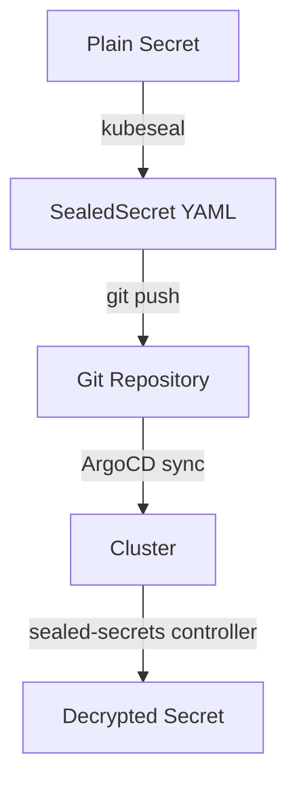

# Manage Sealed Secrets

This project uses [Sealed Secrets](https://sealed-secrets.netlify.app/) to store
encrypted secrets in the Git repository. The `sealed-secrets` controller in the
cluster decrypts them at deploy time.

## How it works



1. You create a standard Kubernetes Secret (dry-run, not applied to the cluster).
2. `kubeseal` encrypts it using the cluster's public key — only that specific cluster
   can decrypt it.
3. The resulting `SealedSecret` YAML is safe to commit to Git.
4. ArgoCD syncs the SealedSecret to the cluster.
5. The sealed-secrets controller decrypts it into a regular Secret.

## Existing SealedSecrets

:::{important}
SealedSecrets are encrypted for a **specific cluster**. If you forked this repo,
the existing sealed secret files will not decrypt on your cluster — the
sealed-secrets controller will log errors but the cluster will otherwise run
normally. You must create your own secrets by following {doc}`cloudflare-tunnel`
and {doc}`oauth-setup`.
:::

These secrets are created during the setup guides:

| Secret | Namespace | Purpose | File |
|--------|-----------|---------|------|
| `cloudflared-credentials` | `cloudflared` | Cloudflare tunnel token | additions/cloudflared/tunnel-secret.yaml |
| `cloudflare-api-token` | `cert-manager` | DNS-01 API token | additions/cert-manager/templates/cloudflare-api-token-secret.yaml |
| `oauth2-proxy-secret` | `oauth2-proxy` | OAuth2 cookie + client secrets | additions/oauth2-proxy/oauth2-proxy-secret.yaml |
| `alertmanager-slack-secret` | `monitoring` | Alertmanager Slack webhook URL | additions/grafana/alertmanager-slack-secret.yaml |

## Prerequisites

- `kubeseal` is installed in the devcontainer (via the `tools` role)
- The `sealed-secrets` controller is running in the cluster (deployed by ArgoCD)
- `kubectl` has access to the cluster (kubeconfig configured)

## Create a new SealedSecret

### From a literal value

```bash
# Prompt for the secret value (not echoed, not stored in shell history)
printf 'Secret value: ' && read -rs SECRET_VALUE && echo

# Create the SealedSecret
printf '%s' "$SECRET_VALUE" | \
  kubectl create secret generic my-secret-name \
    --namespace my-namespace \
    --from-file=my-key=/dev/stdin \
    --dry-run=client -o yaml | \
  kubeseal --controller-name sealed-secrets \
    --controller-namespace kube-system -o yaml > \
    kubernetes-services/additions/my-service/my-secret.yaml

unset SECRET_VALUE
```

### From a file

```bash
kubectl create secret generic my-secret-name \
  --namespace my-namespace \
  --from-file=my-key=path/to/secret-file \
  --dry-run=client -o yaml | \
kubeseal --controller-name sealed-secrets \
  --controller-namespace kube-system -o yaml > \
  kubernetes-services/additions/my-service/my-secret.yaml
```

### With multiple keys

```bash
kubectl create secret generic my-secret-name \
  --namespace my-namespace \
  --from-literal=username=admin \
  --from-literal=password=supersecret \
  --dry-run=client -o yaml | \
kubeseal --controller-name sealed-secrets \
  --controller-namespace kube-system -o yaml > \
  kubernetes-services/additions/my-service/my-secret.yaml
```

## Commit and deploy

```bash
git add kubernetes-services/additions/my-service/my-secret.yaml
git commit -m "Add my-secret SealedSecret"
git push
```

ArgoCD syncs the SealedSecret automatically.

## The `seal-argocd-dex` recipe

`scripts/seal-argocd-dex` seals all authentication-related secrets and
supports both a one-shot bootstrap mode and per-secret subcommands for
rotation.

### Secrets it manages

| Secret | Namespace | Subcommand | Source |
|--------|-----------|------------|--------|
| `argocd-dex-secret` | `argo-cd` | (all paths) | GitHub OAuth credentials + every Dex static client secret |
| `argocd-monitor-oauth` | `argocd-monitor` | `monitor` | oauth2-proxy client + fresh cookie secret |
| `grafana-oauth-secret` | `monitoring` | `grafana` | Grafana Dex client secret |
| `open-webui-oauth-secret` | `open-webui` | `open-webui` | Open WebUI Dex client secret |
| `alertmanager-slack-secret` | `monitoring` | `slack` | Slack incoming webhook URL |

### Bootstrap mode (seal everything)

Use this on initial setup or after a cluster rebuild:

```bash
GITHUB_CLIENT_ID=Iv1.xxx \
GITHUB_CLIENT_SECRET=xxx \
SLACK_WEBHOOK_URL=https://hooks.slack.com/services/... \
  scripts/seal-argocd-dex
```

Equivalent to `scripts/seal-argocd-dex all`. Any variable you omit is
prompted for interactively. Leave `SLACK_WEBHOOK_URL` blank at the
prompt to skip sealing the Alertmanager Slack secret.

### Rotate a single secret

The subcommands re-seal one logical secret without re-prompting for
unrelated values. They read existing keys from the running
`argocd-dex-secret` to preserve everything they don't touch, so you
must have run `all` once before.

```bash
scripts/seal-argocd-dex github       # Update GitHub OAuth credentials
scripts/seal-argocd-dex argocd       # Re-derive argo-cd client from server.secretkey
scripts/seal-argocd-dex monitor      # Rotate argocd-monitor client + cookie
scripts/seal-argocd-dex grafana      # Rotate grafana Dex client secret
scripts/seal-argocd-dex open-webui   # Rotate open-webui Dex client secret
scripts/seal-argocd-dex slack        # Re-seal alertmanager Slack webhook
```

The `slack` subcommand stands alone (its secret is not part of
`argocd-dex-secret`). Pass `SLACK_WEBHOOK_URL=...` or it prompts
interactively — blank input is an error in this mode (use `all` to
skip).

### After running

Commit the updated `*-secret.yaml` files and push. ArgoCD syncs them
and the sealed-secrets controller decrypts them. Pods that read
secrets via `envFrom` or `secretKeyRef` (Dex, Grafana, Open WebUI,
Headlamp, argocd-monitor) cache values at startup, so the script also
rolls out the affected workloads automatically.

## Rotate a secret

To update an existing SealedSecret with a new value:

1. Re-run the `kubeseal` command above, overwriting the existing file.
2. Commit and push.
3. ArgoCD syncs the updated SealedSecret.
4. The sealed-secrets controller replaces the decrypted Secret.
5. Restart any pods that use the secret to pick up the new value:

```bash
kubectl rollout restart deployment/my-deployment -n my-namespace
```

## Troubleshooting

### SealedSecret not decrypting

Check the sealed-secrets controller logs:

```bash
kubectl logs -n kube-system deployment/sealed-secrets -f
```

Common issues:

- **Wrong controller name/namespace** — ensure `kubeseal` flags match the deployed
  controller (`--controller-name sealed-secrets --controller-namespace kube-system`).
- **Wrong cluster** — SealedSecrets are encrypted for a specific cluster. A SealedSecret
  created against one cluster cannot be decrypted by another.
- **Namespace mismatch** — by default, SealedSecrets are scoped to the namespace
  specified at creation time. The Secret must be deployed to the same namespace.

### Re-seal after cluster rebuild

If you rebuild the cluster (new sealed-secrets controller = new keypair), all existing
SealedSecrets become undecryptable. You must re-seal every secret:

1. Retrieve the original plain-text values.
2. Re-run `kubeseal` against the new cluster.
3. Commit and push the updated SealedSecret files.

:::{tip}
Back up the sealed-secrets controller's private key if you want to preserve the ability
to re-use existing SealedSecrets after a rebuild:

```bash
kubectl get secret -n kube-system -l sealedsecrets.bitnami.com/sealed-secrets-key \
  -o yaml > sealed-secrets-key-backup.yaml
```

Store this backup **securely** (not in Git!) — it can decrypt all your SealedSecrets.
:::

## Gotchas

### Encryption is bound to name and namespace

SealedSecrets are encrypted for a **specific Secret name and namespace**. You
cannot rename a SealedSecret YAML file's `metadata.name` or `metadata.namespace`
and expect it to decrypt — you must re-run `kubeseal` with the new name/namespace.

### Merging into existing Secrets

If a Secret already exists in the cluster (e.g., created by a Helm chart) and you
want the sealed-secrets controller to manage it, add this annotation to the
**existing** Secret:

```yaml
metadata:
  annotations:
    sealedsecrets.bitnami.com/managed: "true"
```

Without this annotation, the controller will not overwrite the existing Secret.

### Avoid sealing into `argocd-secret`

The ArgoCD `argocd-secret` in the `argo-cd` namespace is managed by ArgoCD itself.
Sealing values into it causes conflicts — ArgoCD and the sealed-secrets controller
fight over the Secret contents. Use a separate SealedSecret and mount it where
needed instead.

### File naming for gitleaks

SealedSecret files must be named `*-secret.yaml` (singular) to match the
`.gitleaks.toml` allowlist. Files named `*-secrets.yaml` (plural) will be flagged
as leaked secrets by the pre-commit hook.
